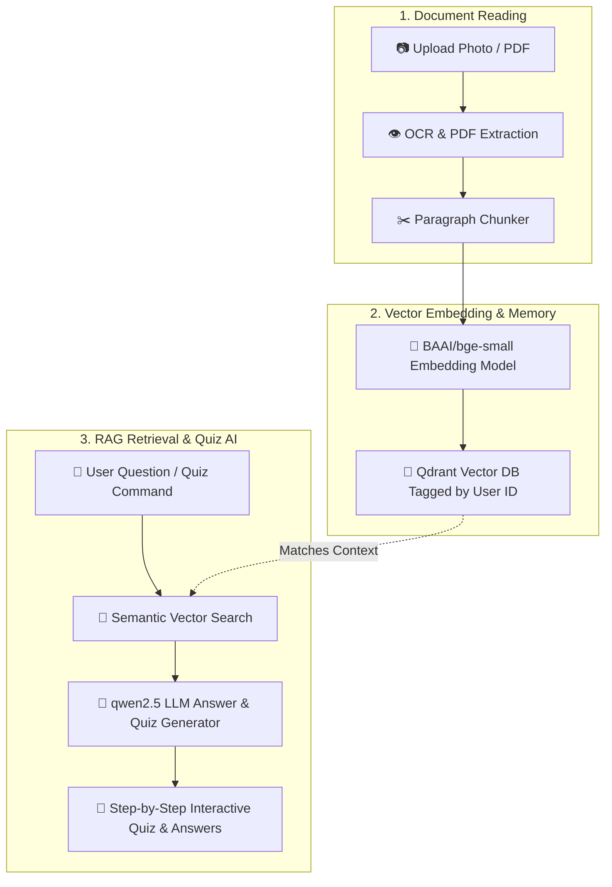

# 🎓 AI Tutor Agent & Telegram Bot

> **An intelligent, local AI Textbook Tutor developed by [Adithyan](https://adithyan-portfolio.pages.dev)**  
> Upload textbook photos or PDFs and instantly get **Interactive Quizzes**, **Answers to Questions**, and **Structured Study Notes**!

---

## 🎨 How It Works (Simple Explanation for Anyone!)

Think of **AI Tutor Agent** as a super-smart digital tutor that reads your textbook for you.

### 🛠️ Complete Technical & RAG Pipeline Diagram

```
=========================================================================================
                                📄 STEP 1: UPLOAD & OCR
=========================================================================================
  [ 📷 Textbook Image / 📄 PDF File ]
                 │
                 ▼
  [ 👁️ qwen3-vl:4b Vision OCR / PyMuPDF ] ──► Extracts clean raw textbook text
                 │
                 ▼
  [ ✂️ Semantic Text Chunker ] ──────────────► Breaks text into 500-character study paragraphs

=========================================================================================
                           🧠 STEP 2: EMBEDDING & VECTOR DB
=========================================================================================
  [ 📝 Text Chunks ]
                 │
                 ▼
  [ 🔢 BAAI/bge-small-en-v1.5 Model ] ─────► Converts text into mathematical vector numbers
                 │
                 ▼
  [ 💾 Qdrant Vector Database ] ────────────► Stores vectors tagged with user_id for privacy

=========================================================================================
                            💬 STEP 3: RAG SEARCH & AI QUIZ
=========================================================================================
  [ ❓ User Question / Quiz Request ]
                 │
                 ▼
  [ 🔎 Vector Similarity Search ] ──────────► Finds exact matching pages from Qdrant
                 │
                 ▼
  [ 🤖 qwen2.5:1.5b Local LLM ] ────────────► Generates precise answers & interactive MCQs!
```

### 🔁 Interactive Pipeline Flowchart



1. **Step 1: Upload & OCR**: Upload a photo or PDF file. The AI uses `qwen3-vl:4b` Vision OCR or `PyMuPDF` to extract text and cut it into clean paragraphs.
2. **Step 2: Embedding & Database**: Paragraphs are sent to `BAAI/bge-small-en-v1.5` which converts human words into numerical vectors and saves them in Qdrant (tagged with your private `user_id`).
3. **Step 3: RAG Retrieval & AI**: When you ask a question or request a quiz, the system performs a vector search in Qdrant to retrieve the exact textbook pages, feeds them to `qwen2.5:1.5b`, and produces instant answers and interactive quizzes!

---

## 🤖 Telegram Bot Commands (`@chatbotbyadhibot`)

| Command | Simple Explanation | What It Does |
| :--- | :--- | :--- |
| `📷 Send Photo` | Send textbook picture | Extracts text from textbook pages using AI Vision |
| `📄 Send PDF` | Send chapter/book PDF | Indexes entire PDF (up to 30MB) |
| `/topics` | View Chapters | Classifies your uploaded material into topics |
| `/quiz` | Interactive Quiz | Starts step-by-step quiz (pick 5, 10, 15 Qs or ✨ Auto) |
| `/notes` | Study Notes | Generates chapter summary study notes |
| `/list` | My Documents | Lists uploaded files with **[🗑️ Delete]** buttons |
| `/clear` | Delete All | Clears all your uploaded documents from database |
| `/help` | Help Menu | Displays bot features and developer portfolio link |

---

## ⚡ Quick Start Guide (Easy Installation)

Run the backend server and web interface in **2 simple steps**:

### 1️⃣ Step 1: Start Backend Server
Open your terminal and run:
```bash
# Go to backend folder
cd backend

# Activate virtual environment
.\venv\Scripts\activate

# Start backend server
uvicorn app.main:app --host 127.0.0.1 --port 8000 --reload
```

### 2️⃣ Step 2: Start Web App
Open a second terminal window and run:
```bash
# Go to frontend folder
cd frontend

# Start web app
python -m http.server 3000
```

### 🌐 Access in Browser
Open **[http://localhost:3000](http://localhost:3000)** in your browser!

---

## 🛠️ System Architecture & Technology Stack

- **AI Model**: `qwen2.5:1.5b` (fast text chat/quiz generation) & `qwen3-vl:4b` (vision OCR fallback) via [Ollama](https://ollama.com/)
- **Embeddings**: `BAAI/bge-small-en-v1.5` via FastEmbed
- **Vector Storage**: Qdrant Local Engine (with per-user privacy isolation)
- **Telegram Bot**: Python-Telegram-Bot (Async Polling & HTML Hyperlinks)
- **Web UI**: Modern responsive dashboard with interactive quiz player and dark glassmorphism styling

---

## 📊 Project Status (50%+ Completed)

- [x] **PDF & Image Vision Extraction**: Supports up to 30MB PDFs and textbook photos.
- [x] **Per-User Privacy Isolation**: Each user's uploaded materials are kept isolated (`tg_<user_id>` / `web_user`).
- [x] **Educational Off-Topic Guardrails**: Restricts off-topic prompts to focus strictly on study materials.
- [x] **Interactive Step-by-Step Quiz Player**: Question-by-question navigation with instant green/red option validation and final score cards.
- [x] **Adaptive Dynamic Quiz Sizing**: Automatically adjusts question counts based on content density.
- [x] **Telegram Bot Menu & HTML Formatting**: Clean hyperlinking for developer **Adithyan** (`https://adithyan-portfolio.pages.dev`).

---

## 👨‍💻 Developer

Developed by **[Adithyan](https://adithyan-portfolio.pages.dev)**  
Portfolio: [https://adithyan-portfolio.pages.dev](https://adithyan-portfolio.pages.dev)
